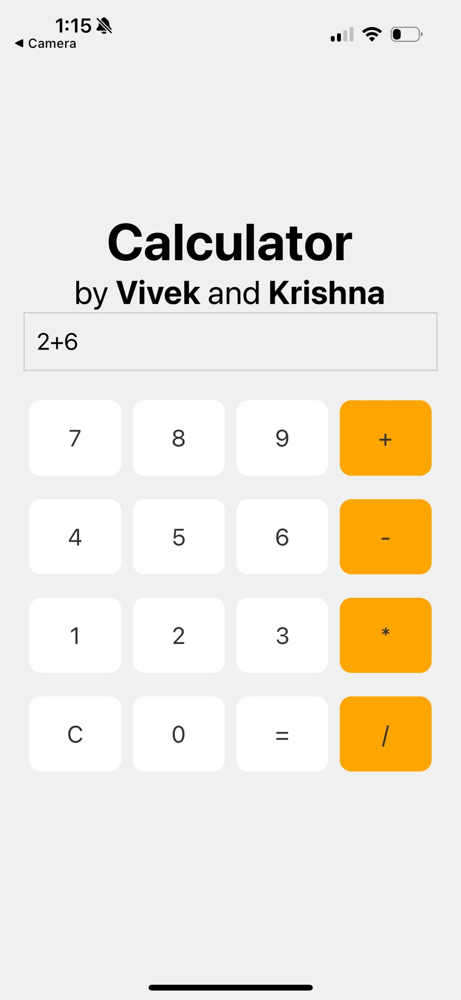
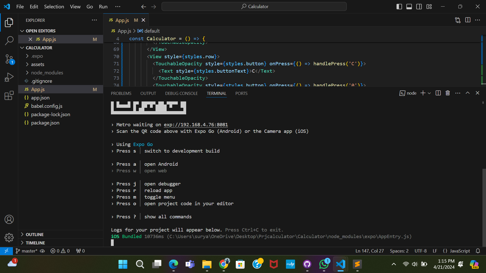

# Tech for Mobile Apps

## Instructor: Dr. William Agangiba

# Project Topic: Calculator Mobile Application

# Team members

1. Vivek Surya Kothapalli, kothapva@mail.uc.edu

2. Krishna Teja Mulagundla, mulaguka@mail.uc.edu

# Project Management Information

Source code repository: [https://github.com/kothapva-uc/TMA-calculator](https://github.com/kothapva-uc/TMA-calculator)

# Overview

This is a simple calculator application which was created by using React Native, JavaScript, CSS. The mobile application has been tested and verified using expo-go. The results of the application are shown below.

# Results

Mobile App

Source code

# Video Demonstration

[Video demo](https://mailuc-my.sharepoint.com/:v:/g/personal/kothapva_mail_uc_edu/EXmiD1BX4jJLhigourIaRQsBqESyQOE00nRuWCUYXPDi8w?e=q2LBQl&nav=eyJyZWZlcnJhbEluZm8iOnsicmVmZXJyYWxBcHAiOiJTdHJlYW1XZWJBcHAiLCJyZWZlcnJhbFZpZXciOiJTaGFyZURpYWxvZy1MaW5rIiwicmVmZXJyYWxBcHBQbGF0Zm9ybSI6IldlYiIsInJlZmVycmFsTW9kZSI6InZpZXcifX0%3D)

